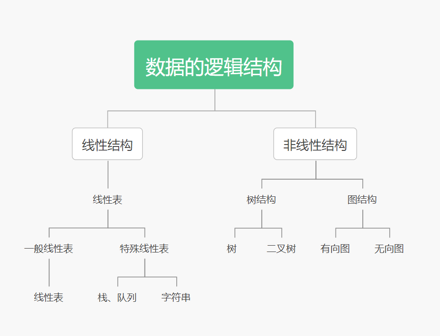

# 数据结构

> - 数据结构是门研究非数值计算程序设计中的操作对象，以及这些对象之间的关系和操作的学科。
> - 简单来说就是特定的数据在计算机内如何按照一定的规则组织，并操作的集合。
> - 一般有 程序=数据结构+算法 的说法。

### 数据

> 数据 (Data) 是客观事物的符号表示，是所有能输入到计算机中并被计算机程序处理的符号的总称。

### 数据元素

> 数据元素(Data Element)是数据的基本单位，在计算机中通常作为一个整体进行考虑和处理。
>
> 例如学生集合里的每一个学生都是数据元素。

### 数据项

> 数据项 (Data Item) 是组成数据元素的、有独立含义的、不可分割的最小单位。
>
> 例如一个学生的学号、姓名、成绩等都是数据项。

### 数据对象

> 数据对象 (Data Object) 是性质相同的数据元素的集合，是数据的一个子集。
>
> 例如将全校学生作为一个数据，1班的学生就是一个数据对象。

## 数据结构

数据结构 (Data Structure) 是相互之间存在一种或多种特定关系的数据元素的集合。换句话说，数据结构是带 ”结构＂ 的数据元素的集合， “结构” 就是指数据元素之间存在的关系。

1. 逻辑结构
    1. 集合结构 数据元素之间除了 “属于同一集合” 的关系外，别无其他关系。
    
    2. 线性结构 数据元素之间存在一对一的关系。
    
    3. 树结构 数据元素之间存在一对多的关系。
    
    4. 图结构或网状结构 数据元素之间存在多对多的关系。
     
    
2. 物理结构(存储结构)

    数据元素在计算机中有两种基本的存储结构，分别是顺序存储结构和链式存储结构。

    - 顺序存储结构

    > 顺序存储结构是借助元素在存储器中的相对位置来表示数据元素之间的逻辑关系，通常借助程序设计语言的数组类型来描述。

    - 链式存储结构

    > 顺序存储结构要求所有的元素依次存放在一片连续的存储空间中，而链式存储结构，无需占用一整块存储空间。但为了表示结点之间的关系，需要给每个结点附加指针字段，用于存放后继元素的存储地址。所以链式存储结构通常借助于程序设计语言的指针类型来描述。

## 数据类型

> 数据类型(Data Type)是高级程序设计语言中的一个基本概念，前面提到过顺序存储结构可以借助程序设计语言的数组类型描述，链式存储结构可以借助指针类型描述，所以数据类型和数据结构的概念密切相关。数据类型是一个值的集合和定义在这个值集上的一组操作的总称。

## 抽象数据类型

> 抽象就是抽取出实际问题的本质:抽象数据类型(Abstract Data Type,ADT)一般指由用户定义的、表示应用问题的数学模型，以及定义在这个模型上的一组操作的总称。  
>
> ---
>
> 抽象数据类型=数据对象+数据对象上关系的集合+对数据对象的基本操作的集合。

## 算法

> 算法 (Algorithm) 是为了解决某类问题而规定的一个有限长的操作序列
>
> 算法五个重要特性:
> - 有穷性
> - 确定性
> - 可行性
> - 输入
> - 输出

### 评价算法的优劣

- 正确性
- 可读性
- 健壮性
- 高效
### 算法分析
> ####  时间复杂度分析
>
> ##### 		    分析
>
> - 最好情况
> - 最坏情况
> - 评价情况
> - 均摊情况
>
> ##### 常见复杂度
>
> - O(1): Constant Complexity 常数复杂度
> - O(log n): Logarithmic Complexity 对数复杂度
> - O(n): Linear Complexity 线性时间复杂度
> - O(n^2): N square Complexity 平方
> - O(n^3): N cubic Complexity 立方
> - O(2^n): Exponential Growth 指数
> - O(n!): Factorial 阶乘
> ####  空间复杂度分析
>
> - O(1)常数阶
> - O(n)线性阶
> - O(n^2)平方阶
> - O(n^3)立方阶

